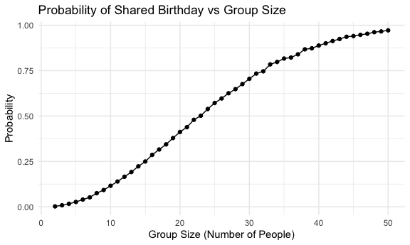
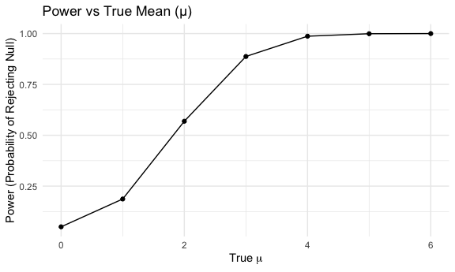
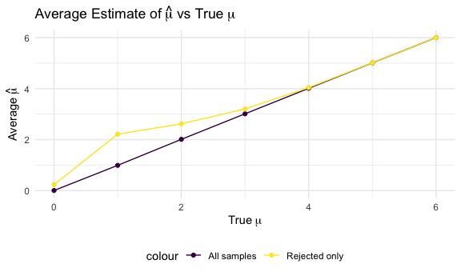

p8105_hw5_xl3494
================
Selina Lyu

## Problem 1

Write a function that, for a fixed group size, randomly draws
“birthdays” for each person; checks whether there are duplicate
birthdays in the group; and returns TRUE or FALSE based on the result.

``` r
share_birthday = function(n) {
  
  birthdays = sample(1:365, size = n, replace = TRUE) 
  return(length(unique(birthdays)) < n)           
  
  }
```

Next, run this function 10000 times for each group size between 2 and
50. For each group size, compute the probability that at least two
people in the group will share a birthday by averaging across the 10000
simulation runs.

``` r
prob_results = 
  expand_grid(
    group_size = 2:50,
    iter = 1:10000) |> 
  mutate(
    share = map_lgl(group_size, share_birthday)) |>
  group_by(group_size) |>
  summarize(prob_share = mean(share))

prob_results
```

    ## # A tibble: 49 × 2
    ##    group_size prob_share
    ##         <int>      <dbl>
    ##  1          2     0.0024
    ##  2          3     0.0085
    ##  3          4     0.0167
    ##  4          5     0.0267
    ##  5          6     0.0399
    ##  6          7     0.0521
    ##  7          8     0.0751
    ##  8          9     0.0925
    ##  9         10     0.116 
    ## 10         11     0.139 
    ## # ℹ 39 more rows

Make a plot showing the probability as a function of group size, and
comment on your results.

``` r
ggplot(prob_results, aes(x = group_size, y = prob_share)) +
  geom_line() +
  geom_point() +
  labs(
    title = "Probability of Shared Birthday vs Group Size",
    x = "Group Size (Number of People)",
    y = "Probability"
  )
```


This plot shows the probabilities that at least two people share a
birthday for group size of 2 to 50. When group size is small (\<15), the
probabilities are low. The increase in probabilities becomes faster when
group size increases to 15-35. The probabilities approach to 1 as the
group size further increases to 50.

## Problem 2

Function of μ and run 5000 datasets for μ = 0:6

``` r
sim_test = function(mu) {
  
  x = rnorm(n = 30, mean = mu, sd = 5)
  ttest = t.test(x, mu = 0)
  tidy(ttest) |>
    select(estimate, p.value) |>
    rename(mu_hat = estimate) |>
    as_tibble()
  
}

test_result = 
  expand_grid(
    true_mu = 0:6, 
    iter = 1:5000
  ) |>
  mutate(output = map(true_mu, sim_test)) |>
  unnest(output)

test_result
```

    ## # A tibble: 35,000 × 4
    ##    true_mu  iter  mu_hat p.value
    ##      <int> <int>   <dbl>   <dbl>
    ##  1       0     1 -1.62    0.0545
    ##  2       0     2 -0.542   0.569 
    ##  3       0     3 -0.278   0.767 
    ##  4       0     4 -0.303   0.733 
    ##  5       0     5  0.406   0.637 
    ##  6       0     6  0.147   0.881 
    ##  7       0     7  1.20    0.191 
    ##  8       0     8 -0.0542  0.957 
    ##  9       0     9 -0.119   0.878 
    ## 10       0    10 -1.89    0.0712
    ## # ℹ 34,990 more rows

Make a plot showing the proportion of times the null was rejected (the
power of the test) on the y axis and the true value of μ on the x axis

``` r
power_plot = 
  test_result |>
  mutate(reject = p.value < 0.05) |>
  group_by(true_mu) |>
  summarize(power = mean(reject)) |>
  ggplot(aes(x = true_mu, y = power)) +
  geom_line()+
  geom_point() +
  labs(
    title = "Power vs True Mean (μ)",
    x = expression(True~mu),
    y = "Power (Probability of Rejecting Null)"
  )

power_plot
```


The plot shows the relationship between the true mean (μ) and the power
of the one-sample t-test. When μ = 0, the power is about 0.05, matching
the significance level (α = 0.05) because the null hypothesis is true
and should rarely be rejected. As μ increases, the power rises sharply.
As true mean increases, the power approaches 1, indicating the test
almost always rejects the null when the true mean is far from zero.

A plot showing the average estimate of μ vs. true μ and average estimate
of μ only in samples for which the null was rejected vs. true μ

``` r
avg_mu = 
  test_result |>
  group_by(true_mu) |>
  summarize(
    mean_all = mean(mu_hat),
    mean_rejected = mean(mu_hat[p.value < 0.05])
  ) |>
  ggplot(aes(x = true_mu)) +
  geom_line(aes(y = mean_all, color = "All samples")) +
  geom_point(aes(y = mean_all, color = "All samples")) +
  geom_line(aes(y = mean_rejected, color = "Rejected only")) +
  geom_point(aes(y = mean_rejected, color = "Rejected only")) +
  labs(
    title = expression("Average Estimate of"~hat(mu)~"vs True"~mu),
    x = expression(True~mu),
    y = expression("Average"~hat(mu))
  )

avg_mu
```


The “All Samples” line shows that the one-sample t-test provides an
unbiased estimator — on average, the sample mean equals the true μ.
However, the “Rejected only” line sit above the purple line, especially
when true μ is small, showing that when we only look at simulations
where the null hypothesis was rejected, the average μ̂ is larger than the
true μ .This happens because significant results tend to occur when
random sampling error pushes the estimated mean farther from zero. As
true μ, the bias decreases because nearly all tests reject the null, and
selection plays a smaller role.
